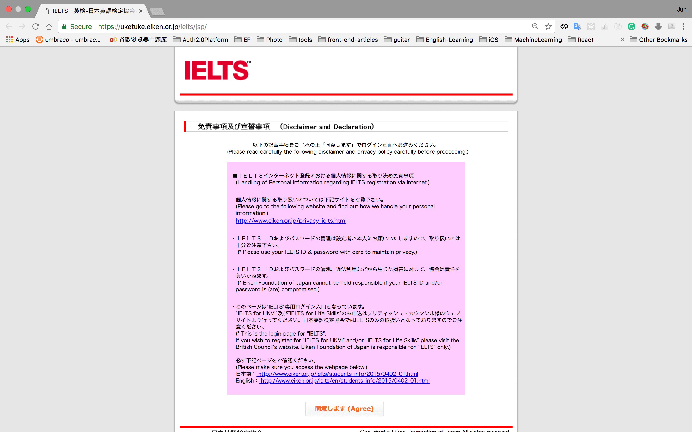
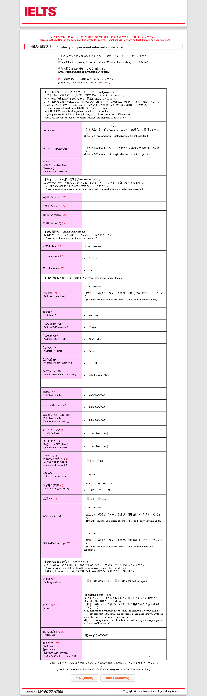
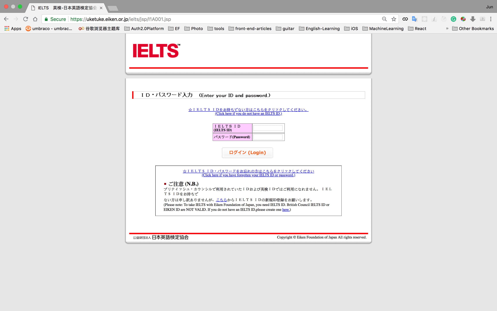
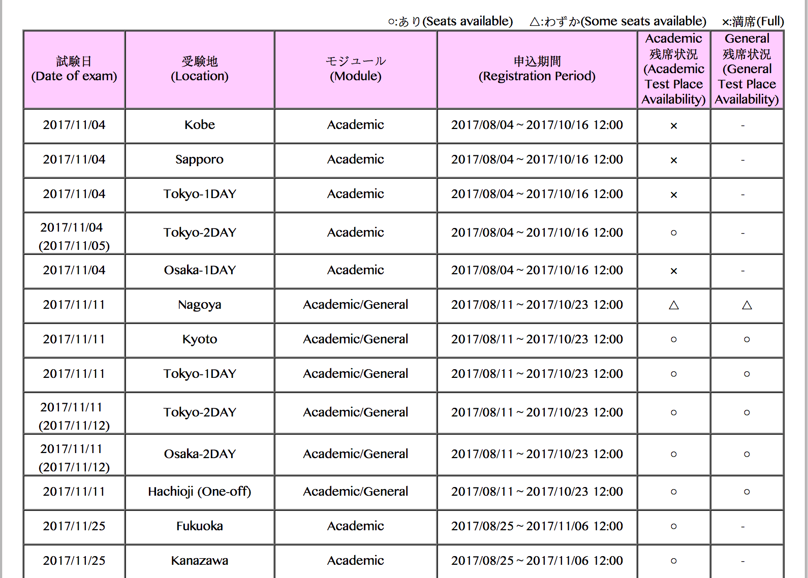
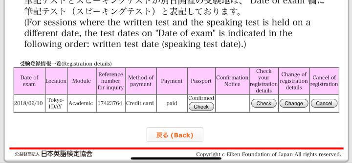

# This is a guide of Ielts Test in Japan

## Register
1. Go to officail website: https://uketuke.eiken.or.jp/ielts/jsp/

2. register your Ielts test account and log in.

3. choose your Ielts test
    1. Type
        * 1 Day Test: all test in one day.
        * 2 Day Test: Listening, Reading, Writing in the first day, Speaking in the second day.
    2. Place
        * choose city, no specific test place.
        * will get the specific place in Conformation Notice column.
        * Test Place Available: https://uketuke.eiken.or.jp/ielts/jsp/I1G_search

4. Register, edit and cancel in 19 days before the test day.

5. Payment
    * Visa, Mastercard, JCB, Nicos (AMEX is unable)
    * register fee: JPY 25380
    * change/cancel fee: JPY 6300

6. Scan Passport and save as JPG, upload it on the website.

7. After 2-3 days, it will show `Confirmed` in Passport column.

8. Test Account Certification(include test time, place, your Ielts account) is in Conformation Notice column, it will show a link in 2 weeks before the test day. You can download the pdf and save it to your phone.

9. Things you should take on
    * Pens: B，H，HB，2B, suggest to take 4 or 5 pens
    * Eraser: without wrapper.
    * One bottle water: without wrapper and transparent.
    * A colorful copy of your Passport(not sure is necessary, but better to take it)

10. Test day prepare
    1. Leave personal belongings in the Luggage Room. Will give you two sticker and one bag. One sticker will put on your passport and another to put on your bag.
    2. Go to Toilet.
    3. Go to check ID.
    4. Enter test room and wait.

11. Notice
    * 09:00 - 09:15 Instructions
    * 09:15 - 09:55 Listening Test (Toilet unable)
    * 10:00 - 11:00 Reading Test (Toilet available, last 10 mins unable)
    * 11:10 - 12:10 Writing Test (Toilet available, last 10 mins unable)
    * There will be some pencil sharpeners and tissues for examinee to use.
    * There will be no microphones in Listening test, they use broadcasting system, but very clearly.

12. Report
    * will be sent after 13 days.
    * EMS, Free

